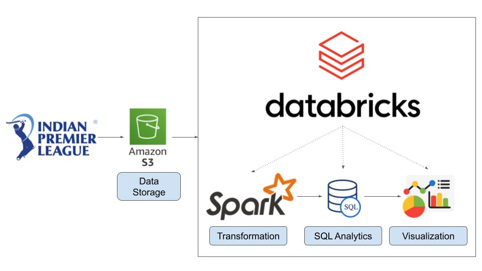

# IPL-Data-Analysis-End-To-End-Apache-Spark-Databricks-Project
This is an End-To-End Data Engineering project that performs large-scale analysis of IPL cricket match data using using Apache Spark (PySpark) and Databricks.
The goal is to derive insights such as venue-wise scoring patterns, player performance and match trends.

## Architecture
- Data Source: CSV files stored on S3
- Processing Engine: Apache Spark (PySpark)
- Platform: Databricks
- Visualization: Matplotlib & Seaborn

## Technology Used
- Programming Language - Python & PySpark
- AWS S3 (Data Source)
  
1. PySpark & Spark SQL (Transformation logic)
2. Apache Spark Basics and Databricks
3. Pandas (For Data Cleaning)
4. Matplotlib & Seaborn (Visualizing data for insights)
- Apache Spark

## Key Analysis
- Average and highest scores by venue
- Player-wise performance analysis
- Match-level aggregations
- Data quality handling and transformations

## How to Run
1. Upload the data to S3
2. Configure Spark session
3. Run the scripts

## Learnings
- Optimized Spark SQL queries
- Handling large datasets efficiently
- Spark → Pandas visualization workflow
- Data engineering best practices

## Future Improvements
- Add Delta Lake support
- Implement data quality checks
- Add Airflow orchestration

## Dataset Used
Here is the dataset used in the project - https://data.world/login?next=%2Fraghu543%2Fipl-data-till-2017
